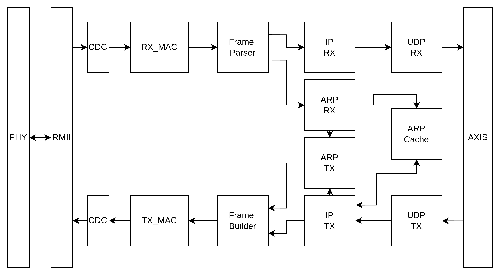

# nekSoC-ethernet
## Modular FPGA 100Mbps Ethernet Stack (RMII → MAC → IPv4/ARP/UDP → AXI-Stream) 

An in-progress modular Ethernet hardware stack. Built with a low-latency cut-through architecture and a standard AXI-Stream interface for user applications.

### Architecture Overview
All data is cut-through/streaming, there is no buffering/FIFO except at the TX CDC boundary since the RMII runs a slower clock. Headers are parsed/builded on-the-fly.

### Specs
- Internal clock running at 125MHz
- RMII @ 50MHz (100Mbps link mode)
- Non-matching MAC/IP packets dropped 
- Hardware header parsing with crc validation/generation
- ARP Request/Reply logic with a cache
- Standard 8-bit AXI-Stream for app layer

### Perfomance & Verification
- Verified on the Tang Primer 20K.
- Tested with a Python script blasting random UDP packets directly from a PC to the FPGA (tested with 100k packets). The FPGA runs a top loopback module. The script waits for the successful loopback return before dispatching the next packet.

### To-Do List
- Test packet burst loopback
- Implement AXI4-Lite registers for dynamic configuration of:
    * Local MAC & IPv4 Address
    * App Ports
- Add AXI4-Lite status registers to track statistics like dropped packets, CRC errors, frame faults, filtered packets.
- Upgrade ARP cache to a more intelligent approach  
